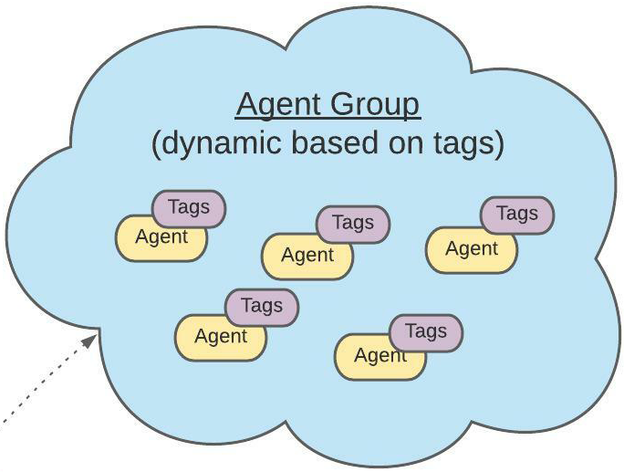
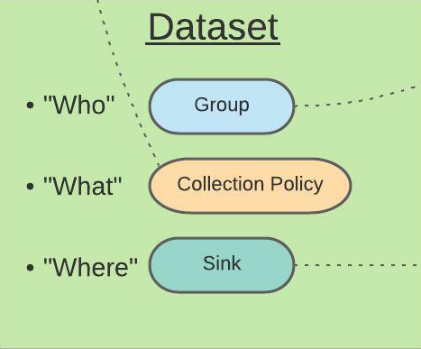

## The story
Born at [NS1 Labs](https://ns1.com/labs), **Orb** is a new kind of observability platform that makes it easier for operators and developers to gain a deeper understanding of their networks, distributed applications, and traffic flows in real time. Orb supplements your observability stack by providing dynamic orchestration of observability agents that can extract business intelligence at the edge. The platform is completely [open source](https://github.com/ns1labs/orb), extensible, vendor-neutral, and cloud-native.

## The components
### The agents
Orb manages **observability agents** that collect network data from applications, systems, and edge locations (VMs, containers, servers) in real time. An agent acts as a sensor installed next to a data source so it can summarize, analyze, and collect information. You run agents on your edge locations and orchestrate them via the control plane.

While ingesting a high volume of information-dense data streams, the agents translate this information to deliver consumable, actionable data sets. Developers and network operators can view this data locally at the edge via the agent's command-line interface and globally in a central database via a standard dashboard tool (such as Grafana).

### The control plane
Orb combines concepts from edge computing, the Internet of Things (IoT), and high-throughput stream processing.

As an IoT-inspired cloud **control plane**, Orb connects a fleet of distributed observability agents (such as the [open source pktvisor](https://github.com/ns1labs/pktvisor/)) deployed at the edge and gives you command over that fleet. In operating the control plane, you issue instructions to the agents, dynamically programming and re-programming them with data-collection policies to build different data sets in real time.

## The features
Orb orchestrates network observability policies across a fleet of agents on the edge—providing you with lightweight, immediately actionable results.

* Plugs into popular observability stacks, like Prometheus and Elasticsearch, as well as cloud storage and data pipelines
* Built using a cloud-native, microservices-based architecture
* Offers a self-hosted (via Docker Compose or Kubernetes) or a SaaS option

Orb focuses on edge analysis, preferring “small data”-style, actionable metrics over the collection and storage of terabytes of raw, inscrutable data.

* Allows you to visualize and automate on data at the edge for a hyper-real-time local view or centrally in the cloud for global a view
* Streamlines data collection and exporting back to the control plane where it is available for analytics, security, automation, etc.
* Provides a single pane of glass across all sensors

## Orb + pktvisor
 Via Orb's user interface, you decide what data to extract from which agents. The resource-efficient, side-car style [pktvisor](https://github.com/ns1/pktvisor) observability agent performs edge analysis on network data streams. 
 
 This combination allows you to:

* Adjust analysis and collection parameters dynamically across the entire fleet via a powerful control plane
* Perform centralized fleet management, allowing you to configure heartbeats, tagging, and grouping for each of the pktvisor agents
* Orchestrate data-set policies that specify the type of data to extract from each agent

In terms of metrics, pktvisor can capture DNS, DHCP, and L2/L3 network data via packet capture, `dnstap`, `sflow`, among other input methods. 

For a complete list of metrics currently collected by pktvisor, look [here](https://github.com/ns1labs/pktvisor/wiki/Current-Metrics).

To view a Grafana dashboard for visualizing pktvisor Prometheus metrics, look [here](https://grafana.com/grafana/dashboards/14221).

## Core Concepts

The concepts below comprise Orb’s architecture.

{ width="700" }

### Agent
This is a sensor installed next to a data source (at the edge) so it can summarize, analyze, and collect information.

{ width="250" }

### Agent group
This is a list of simple key/value pairs that match against agent tags to dynamically define a group of agents. For example, “region: US” will group all agents in the fleet that have this key/value set in their tags.

{ width="250" }

### Fleet
This is a collection of agents which may be widely distributed and number in the tens, hundreds, or thousands and are all able to connect to and contribute to the same observability system.

{ width="250" }

### Policies
These are the instructions sent to the agents to define how to collect metrics. It is backend-specific information that is needed at the edge.

### Dataset
These are instructions for how specific agents in the fleet (matched according to a given agent group), should apply collection policies and where they should sink their data. Orb will manage many data sets concurrently.

{ width="250" }

### Sinks
This is where you send the data. This is the system that collects the data and allows you to sync that data to different locations. Currently, Orb supports Prometheus but will support more backends in the future.
