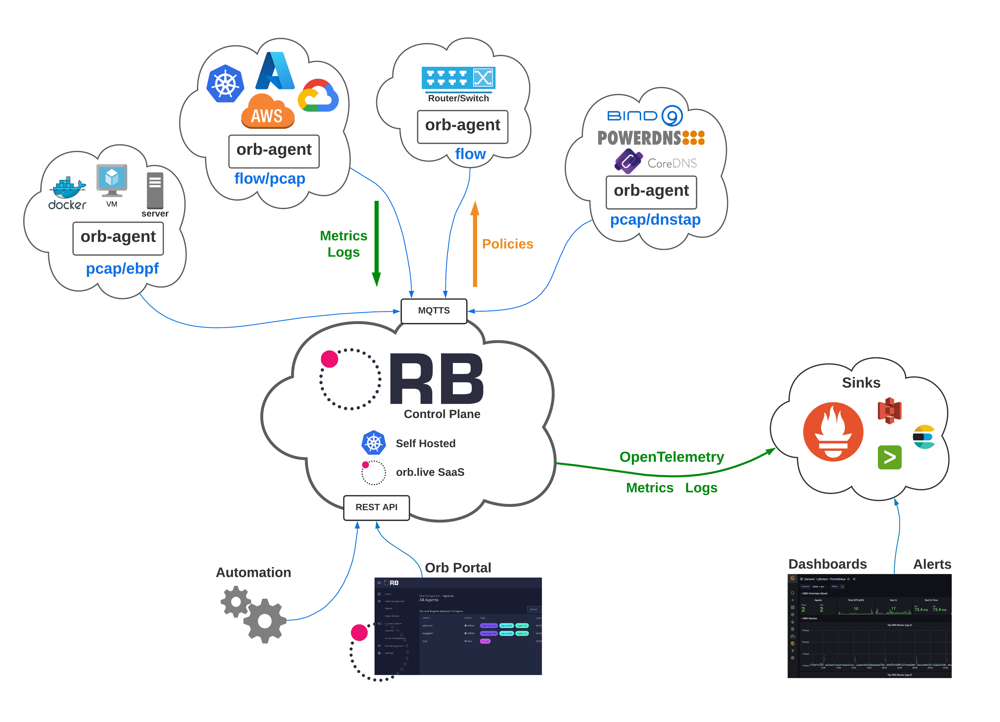

# Features
## Form
 **Orb** orchestrates network observability policies across a fleet of agents on the edge—providing you with lightweight, immediately actionable results in real time.

* Plugs into popular observability stacks, like Prometheus and Elasticsearch, as well as cloud storage and data pipelines
* Powered by a fast, reliable, secure, modular, extensible, open-source platform
* Enables dynamic administration and configuration
* Deployed as a modular system of inputs and analyzers
* Built using a cloud-native, microservices-based architecture
* Offers a self-hosted (via docker-compose or k8s) or SaaS option

## Function
 The resource-efficient, side-car style [pktvisor](https://github.com/ns1/pktvisor) observability agent performs edge analysis on network data streams, while an IoT-inspired central control plane and UI provides fleet and configuration management tools.

* Adjusts analysis and collection parameters dynamically across the entire fleet via a powerful control plane
* Provides centralized fleet management, allowing you to configure heartbeats, tagging, and grouping for each of the pktvisor agents
* Orchestrates data set policies that specify the type of data to extract from each agent

## Outcome
**Orb** focuses on edge analysis, preferring “small data”-style, actionable metrics over the collection and storage of terabytes of raw, inscrutable data.

* Allows you to visualize and automate on data at the edge for a hyper-real-time *local view* or centrally in the cloud for a *global view*
* Streamlines data collection and exporting back to the control data where it is available for analytics, security, automation, etc.
* Provides a single pane of glass across all sensors
* Delivers the necessary tools to help you make more effective network decisions

