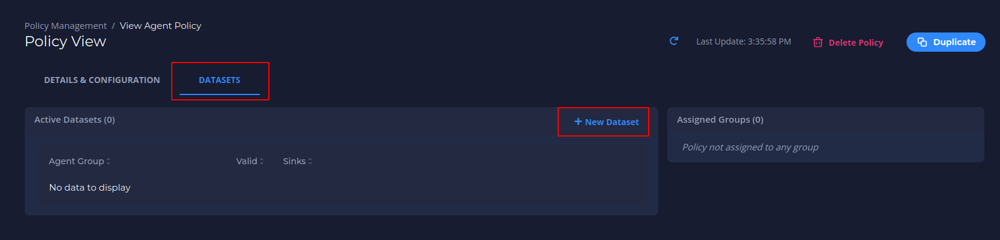

# Configure what to monitor

### Create an Agent Group

Agents are organized into agent groups based on key-value tag matching.

1. Navigate to **Agent Groups**, and then click **New Agent Group**.
   

2. Fill in an *Agent Group Name* and click **Next**.
   

3. Fill in the *Key* and *Value* tags, **which need to match the tags of the corresponding Agent**, and click the **+** on the right side of the menu. You should see an icon with your key and value tags appear above the *Key* and *Value* textboxes.
   

4. Click **Next**. You should see a message about the number of agents matching. Then click **Save**.
   
   💡 By clicking in **EXPAND** you can see the agents that are matching with the group (This is optional).
   

5. View the newly created group in the *Agent Groups* list.
   

6. Click the number in the *Agents* column to view the matching agents.
   

### Create a Sink

A sink is a location to send the metrics collected from the agents. The current version supports Prometheus, and future versions will support more options. You can use a private Prometheus instance or use a free [Grafana Cloud](https://grafana.com/products/cloud/) account as a sink.

1. Navigate to **Sink Management**, and then click **New Sink**.
   

2. Fill in a sink name and click **Next**.
   

3. Fill in your sink destination details. This includes the host/username/password from your Prometheus `remote_write` configuration.
   

4. Optionally, add sink tags by filling in the *Key* and *Value* fields. Click **+** after each key-value pair, and then click **Next**.
   

5. Review and confirm your sink details and click **Save**.
   

6. View your newly created sink in the *All Sinks* list.
   

### Create a Policy

Policies tell agents which metrics to collect and how to collect them.

1. Navigate to **Policy Management**, and then click **New Policy**.
   

2. Fill in a policy name and (optionally) a description. The policy name needs to be unique and cannot contain spaces (use underscores or dashes instead). Then click **Next**.
   

3. Select the *Tap* (input stream) to analyze. In this example, we use “default_pcap” which is the default for Packet Capture. All other options are advanced and can be left as is. Click **Next**.
   

4. Click **Add Handler** to add a *Stream Handler* to the policy, which specifies how to analyze the input stream selected in the previous step.
   

5. Add a *Handler Label* for each handler you add. In this example, we want to analyze DNS traffic, so we select the “dns” handler. The only required field here is the *Handler Label*, which is automatically generated for you (handler_dns_1 in this case).
   

6. Enter any customization variables. In this example, we customize the analysis by analyzing only domain names ending in ".ua" or ".ru". This is done with the filter labeled "Include Only QNames With Suffix." We input a comma delimited list of suffixes, so enter ".ua,.ru". Click **Save** after entering any customization to save this Handler.
   

7. You should see your new handler label on the screen. Optionally, add more handlers. Click **Save** to save the policy.
   

### Create a Dataset

Datasets essentially connect all of the previous pieces. By creating and defining a dataset, you send a specific *policy* to a specific *agent group* and establish a *sink* to receive the resulting metrics which allows you to visualize and action on the data.

1. Navigate to the **Policy** you would like to create a Dataset for, then click on New Dataset.
   

2. Select the Agent Group to send the policy to, the Sink(s) you would like to send the resulting metrics to, and give the Dataset a name.
   

3. As soon as you click **Save**, the policy will be sent in real time to the Agents in the Agent Group and begin running.

4. Verify your dataset is active via the *Agent View* screen. Navigate to **Agents** and click on the name of the agent that matches the group you selected in creating the dataset. The *Agent View* screen displays. Under the *Active Policies/Datasets* category, click the **Policy** drop-down (which should accompany a "running" status), and your **Dataset** should display.
   