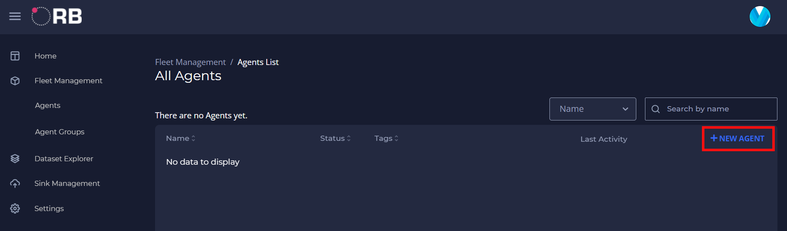
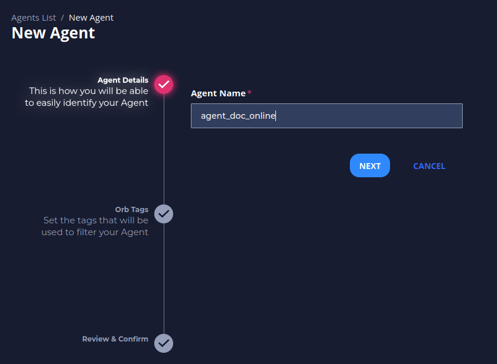
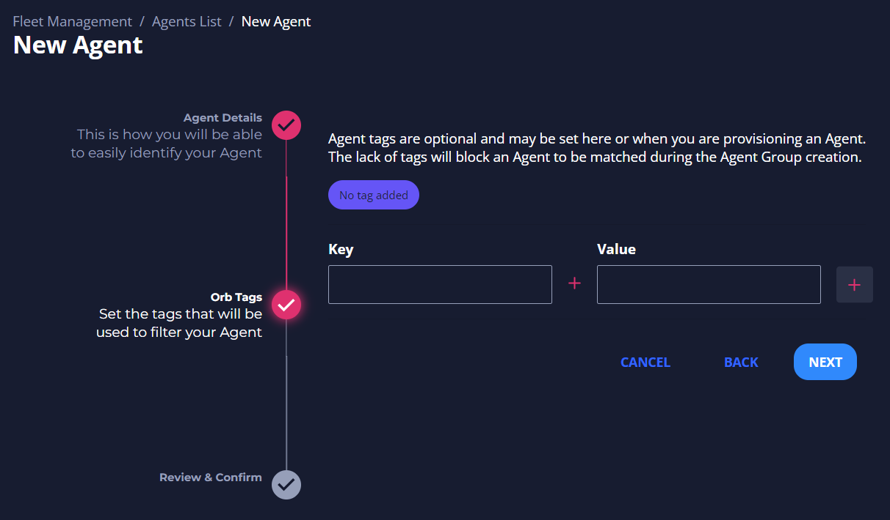
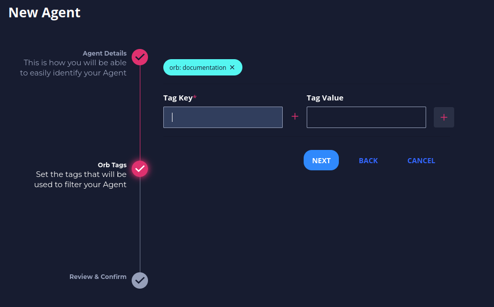
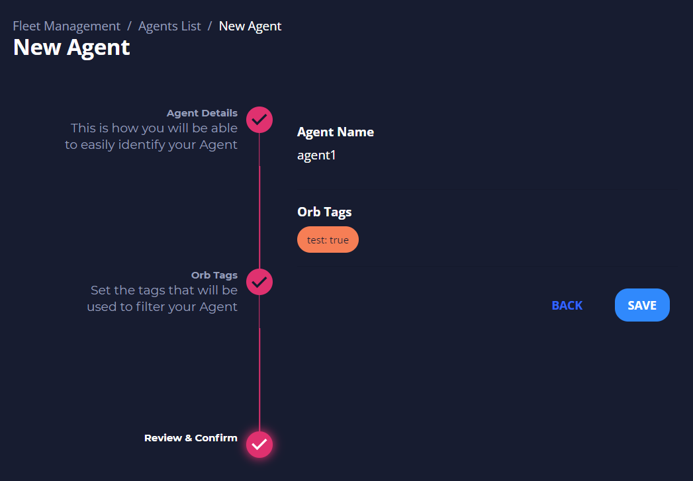
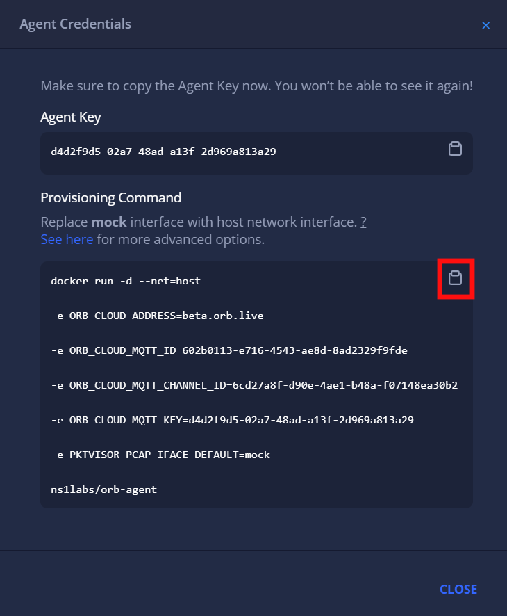
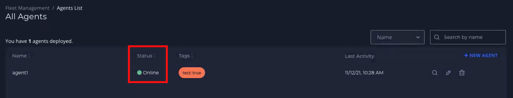

# Deploy your first agent
Follow the steps below after logging in to your Orb Portal to get an agent up and running.

### Create an Agent

You create an agent for each node you want to monitor. Agents are organized by tags. Each agent has a set of corresponding credentials used during provisioning. You may also [provision agents directly at the edge](#advanced-auto-provisioning-setup) instead of through the UI.

1. Navigate to **Agents**, and then click **New Agent**.
   

2. Fill in an *Agent Name* and click **Next**.
   

3. Optionally, fill in *Key* and *Value* tags, then click the **+** on the right side of the menu. These tags represent the way you will assign the agent to an agent group. Reasonable tags might be "location", "region", "pop", "type", etc.
   

4. You should see an icon with your key and value tags appear above the *Key* and *Value* textboxes. Click **Next**.
   

5. Click **Save** to confirm your agent’s name and tags.  
   

6. Your agent credentials should appear. Copy the *Provisioning Command*. This command contains all the information you need to run the Docker container with the given credentials you now have for the agent.
   

7. Paste the *Provisioning Command* into your terminal (optionally edit "mock" to be the real interface name) and run the command. See [Running Orb Agent](/docs/#running-orb-agent) for more details.

8. Close out of the *Agent Credentials* menu. Refresh the *Agents List* in UI. The agent you just created should display an *Online* status.
   

9. Optionally, click the agent's name to view the *Agent View* screen. This screen will contain more information as you add the agent to an agent group and add corresponding policies and datasets.
   