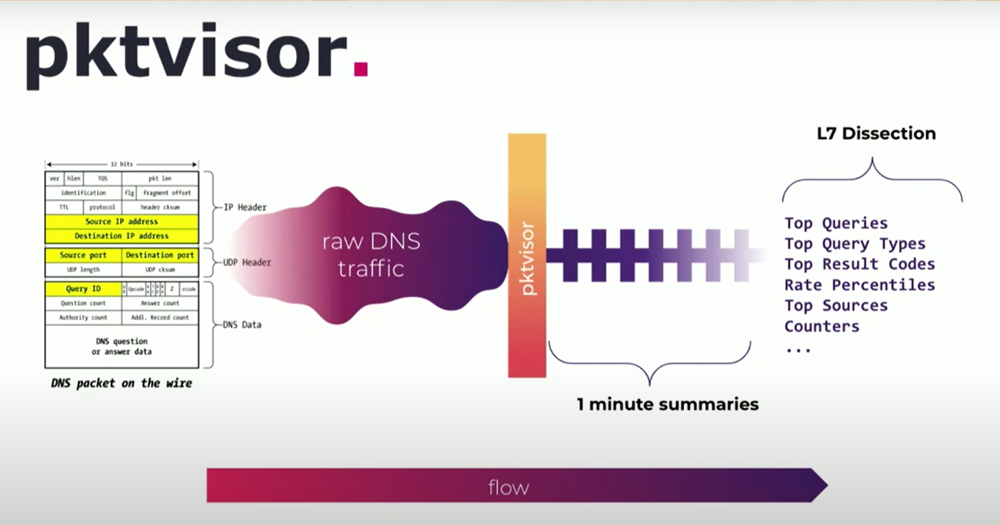

## The story
Born at [NS1 Labs](https://ns1.com/labs), pktvisor has its origins in observability of critical internet infrastructure in support of DDoS protection, traffic
engineering, and ongoing operations. 

NS1 created **pktvisor** to address its own need for more visibility across its global anycast network. As this tool will benefit other organizations leveraging distributed edge architectures, NS1 made it open source and invites the developer community to help drive future updates and innovation.

By efficiently summarizing and collecting key metrics at all of your edge locations, you gain a deep understanding of traffic patterns in real time, enabling rich visualization and fast automation which further increase resiliency and performance.

## pktvisor + Orb
The resource-efficient pktvisor agent performs edge analysis on network data streams. Via the open source [Orb](https://orb.community/), you can decide what data to extract from which agents.

This combination allows you to:

- Adjust analysis and collection parameters dynamically across the entire fleet via a powerful control plane
- Perform centralized fleet management, allowing you to configure heartbeats, tagging, and grouping for each of the pktvisor agents
- Orchestrate data-set policies that specify the type of data to extract from each agent

In terms of metrics, pktvisor has built-in support for DNS, DHCP, and L2/L3 network data via [packet capture](https://en.wikipedia.org/wiki/Packet_analyzer), [dnstap](https://dnstap.info/), [sFlow](https://en.wikipedia.org/wiki/SFlow), [NetFlow](https://en.wikipedia.org/wiki/NetFlow)/[IPFIX](https://en.wikipedia.org/wiki/IP_Flow_Information_Export), among other input methods and is easily extendable 
for other protocols.
 
For a complete list of **metrics currently collected by pktvisor**, look [here](https://github.com/ns1labs/pktvisor/wiki/Current-Metrics).

To view a **Grafana dashboard for visualizing pktvisor Prometheus metrics**, look [here](https://grafana.com/grafana/dashboards/14221).
