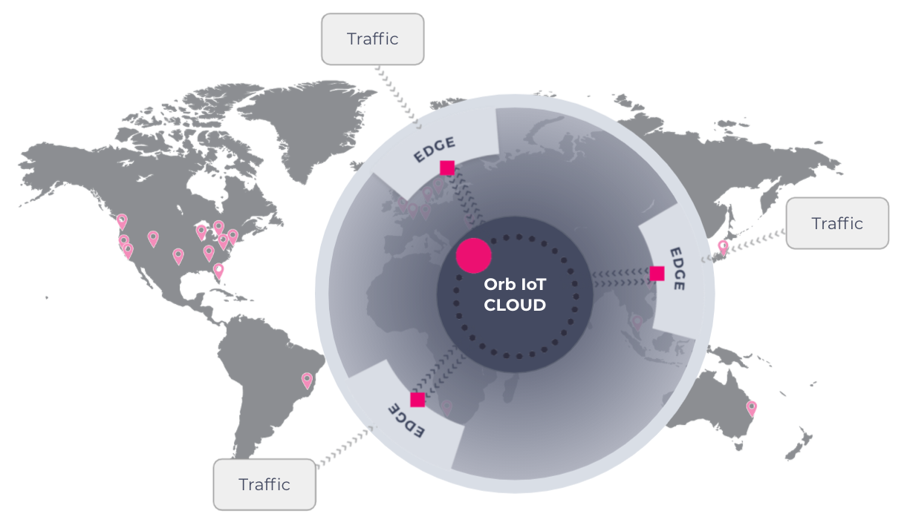

---
hide:
- navigation

---

*A business intelligence platform for orchestrating dynamic edge observability*

## What is Orb?
Born at [NS1 Labs](https://ns1.com/labs), **Orb** is a new kind of observability platform, fully [open source](http://orb.community) and backed by [NS1](https://ns1.com), that helps operators, developers, and end users understand their networks, distributed applications, and traffic flows in real time.

It combines concepts from Internet of Things (IoT), Edge Compute, and high-throughput stream processing to offer command of a fleet of distributed agents that can be orchestrated in real time to summarize high-volume, information-dense data streams down to lightweight, actionable datasets directly at the edge.

<a class="github-button" href="https://github.com/ns1labs/orb" data-size="large" aria-label="Star ns1labs/orb on GitHub">Star on GitHub</a>

## Why use Orb?

**Orb** gives you a precision instrument to collect just the observability data you are interested in, extracting the needles from the haystack at the edge. It is based on
the [pktvisor](https://github.com/ns1/pktvisor) observability agent. The platform is open-source, extensible, vendor-neutral, and cloud-native.

## How does Orb work?
 **Orb** orchestrates network observability policies across a fleet of agents on the edge in real time, allowing you to dynamically filter and collect precise “small data” from your global network, providing you with lightweight, immediately actionable results.

 A side-car style agent (the open-source [pktvisor](https://github.com/ns1/pktvisor)) performs edge analysis on network data streams, combined with an IoT-inspired central control plane and UI that provide fleet and configuration management functionality.

**Orb** focuses on edge analysis, preferring “small data” style actionable metrics over collection and storage of terabytes of raw, inscrutable data: think of it as a scalpel rather than a machete.

* Powerful control plane to adjust analysis and collection parameters in real time across the entire fleet
* Designed to plug in to popular observability stacks, like Prometheus and Elasticsearch, plus cloud storage and data pipelines
* Visualize and automate on results both at the edge (for hyper-real-time local view) or centrally in the cloud (for global view)
* Fast, reliable, secure, modular, extensible, open-source

* Resource-efficient [agent](https://github.com/ns1/pktvisor) that analyzes data streams in real time
* Dynamic administration and configuration
* Modular system of inputs and analysers
* Cloud-native, microservices-based architecture
* Self-host (docker-compose or k8s) or SaaS option
* Manages fleet of pktvisor agents, including heartbeats, tagging and grouping
* Orchestrates dataset policies to decide what data to extract from which agents
* Central collection and exporting of summarized results that are then available for analytics, security, automation, etc.
* Provides a single pane of glass across all sensors
* Provides a deep dive into visualizations and analytics that can help you make more effective network decisions in the future 

