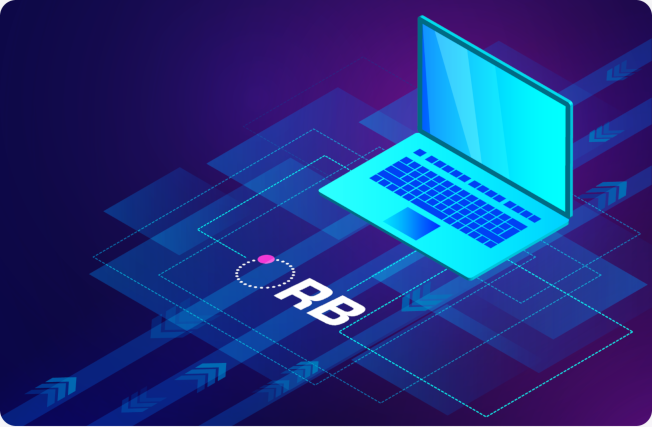
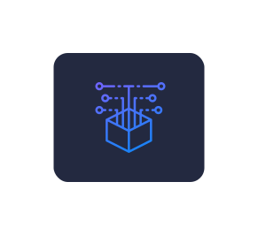

{ align=right .observability }
### Introducing Orb

**Orb** is a modern network observability platform built to provide critical visibility into increasingly complex, segmented, and distributed networks. It can discover devices, analyze network traffic, run synthetic network probes, and connect telemetry to your existing observability stacks with OpenTelemetry.

**Orb** differentiates from other solutions by providing agent fleet management and allowing for dynamic reconfiguration of remote agents in real time.

<h3>Understand</h3>

Understand traffic patterns, identify malicious activity and anomalies, hunt down misconfigurations, and improve network performance across your ever-changing infrastructure by deeply analyzing packets, DNS, flow, connectivity, latency, and more.

<h3>Smartly Analyze and Collect</h3>

Shorten time-to-action and lower costs by dynamically applying composable policies designed
to filter, aggregate and extract the exact information you need, without having
to ship raw data to central data warehouses or expensive SaaS services

<h3>Orchestrate</h3>

Agents are controlled in real time from the Orb Portal or automated through the REST API, allowing instantaneous policy updates across
even massive fleets. Compose data pipelines from targeted groups of agents with precise instructions, sending the results
to modern observability stacks via OpenTelemetry

<h3>Integrate</h3>

The Orb control plane is a modern microservices application with well defined APIs that can be deployed to any Kubernetes service in a private or public cloud, avoiding vendor lock-in. The Orb agent is lightweight and modular, and can scale down
to embedded platforms or up to full servers.
Orb is designed to easily integrate into the larger Network Automation ecosystem.

{ align=left .wherefits .small}
### Where Orb fits

**Orb**’s focus is enabling network automation and visibility across network device control and data planes using a dynamically reconfigurable agent based system.

It is free, open-source software released under Mozilla Public License (MPL). 

***
