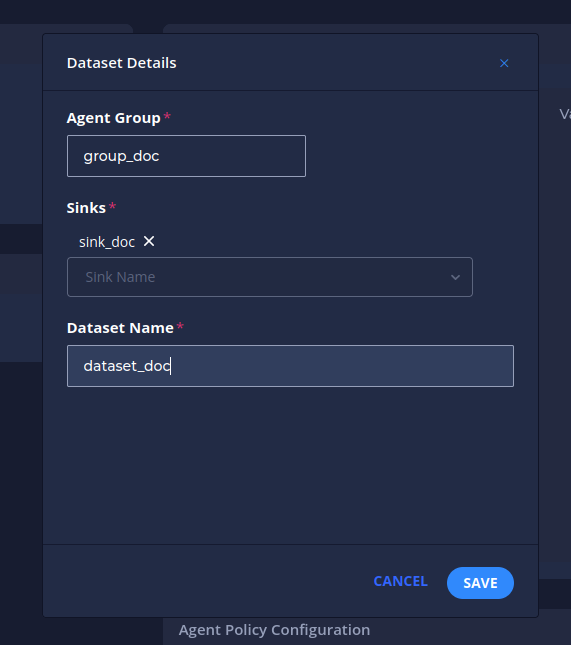
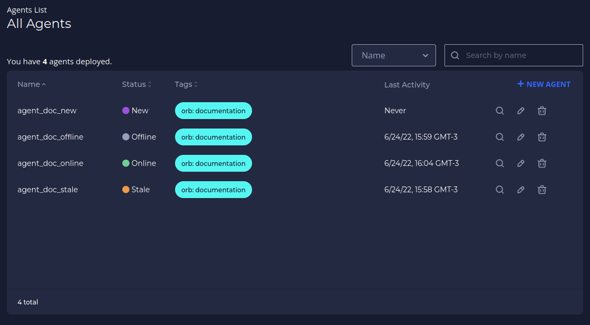
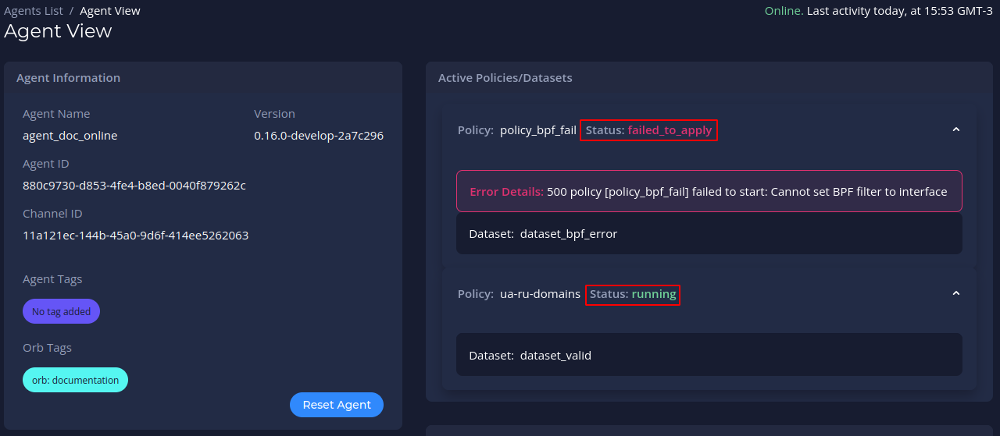
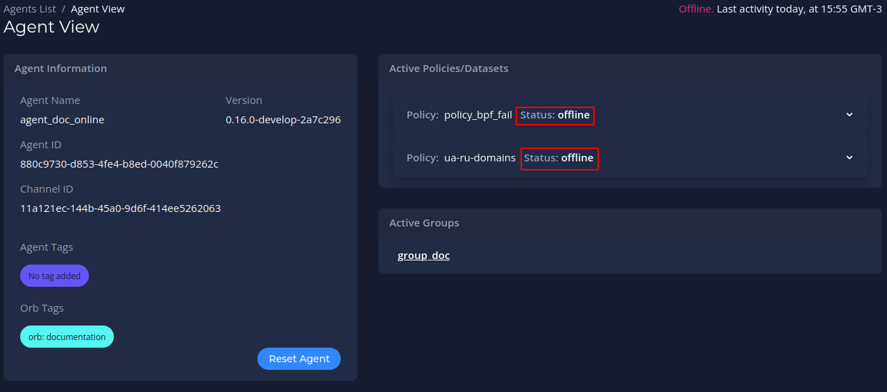
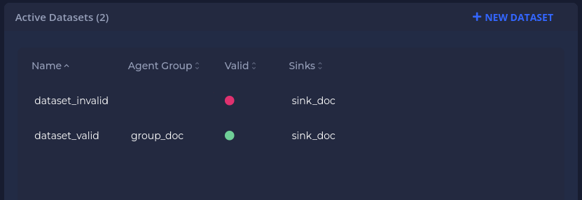
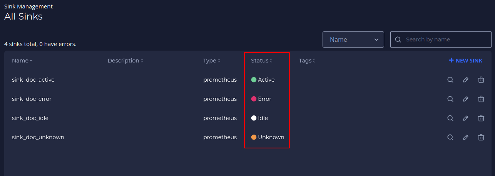

# Setting up your account
Follow the steps below after logging in to your Orb Portal to get an agent up and running.

### Create an Agent

You create an agent for each node you want to monitor. Agents are organized by tags. Each agent has a set of corresponding credentials used during provisioning. You may also [provision agents directly at the edge](#advanced-auto-provisioning-setup) instead of through the UI.

1. Navigate to **Agents**, and then click **New Agent**.
   

2. Fill in an *Agent Name* and click **Next**.
   

3. Optionally, fill in *Key* and *Value* tags, then click the **+** on the right side of the menu. These tags represent the way you will assign the agent to an agent group. Reasonable tags might be "location", "region", "pop", "type", etc.
   

4. You should see an icon with your key and value tags appear above the *Key* and *Value* textboxes. Click **Next**.
   

5. Click **Save** to confirm your agent’s name and tags.  
   

6. Your agent credentials should appear. Copy the *Provisioning Command*. This command contains all the information you need to run the Docker container with the given credentials you now have for the agent.
   

7. Paste the *Provisioning Command* into your terminal (optionally edit "mock" to be real) and run the command. See [Running Orb Agent](/docs/#running-orb-agent) for more details.

8. Close out of the *Agent Credentials* menu. Refresh the *Agents List* in UI. The agent you just created should display an *Online* status.
   

9. Optionally, click the agent's name to view the *Agent View* screen. This screen will contain more information as you add the agent to an agent group and add corresponding policies and datasets.
   

### Create an Agent Group

Agents are organized into agent groups based on key-value tag matching.

1. Navigate to **Agent Groups**, and then click **New Agent Group**.
   

2. Fill in an *Agent Group Name* and click **Next**.
   

3. Fill in the *Key* and *Value* tags, **which need to match the tags of the corresponding Agent**, and click the **+** on the right side of the menu. You should see an icon with your key and value tags appear above the *Key* and *Value* textboxes.
   

4. Click **Next**. You should see a message about the number of agents matching. Then click **Save**.
   
   💡 By clicking in **EXPAND** you can see the agents that are matching with the group (This is optional).
   

5. View the newly created group in the *Agent Groups* list.
   

6. Click the number in the *Agents* column to view the matching agents.
   

### Create a Sink

A sink is a location to send the metrics collected from the agents. The current version supports Prometheus, and future versions will support more options. You can use a private Prometheus instance or use a free [Grafana Cloud](https://grafana.com/products/cloud/) account as a sink.

1. Navigate to **Sink Management**, and then click **New Sink**.
   

2. Fill in a sink name and click **Next**.
   

3. Fill in your sink destination details. This includes the host/username/password from your Prometheus `remote_write` configuration.
   

4. Optionally, add sink tags by filling in the *Key* and *Value* fields. Click **+** after each key-value pair, and then click **Next**.
   

5. Review and confirm your sink details and click **Save**.
   

6. View your newly created sink in the *All Sinks* list.
   

### Create a Policy

Policies tell agents which metrics to collect and how to collect them.

1. Navigate to **Policy Management**, and then click **New Policy**.
   

2. Fill in a policy name and (optionally) a description. The policy name needs to be unique and cannot contain spaces (use underscores or dashes instead). Then click **Next**.
   

3. Select the *Tap* (input stream) to analyze. In this example, we use “default_pcap” which is the default for Packet Capture. All other options are advanced and can be left as is. Click **Next**.
   

4. Click **Add Handler** to add a *Stream Handler* to the policy, which specifies how to analyze the input stream selected in the previous step.
   

5. Add a *Handler Label* for each handler you add. In this example, we want to analyze DNS traffic, so we select the “dns” handler. The only required field here is the *Handler Label*, which is automatically generated for you (handler_dns_1 in this case).
   

6. Enter any customization variables. In this example, we customize the analysis by analyzing only domain names ending in ".ua" or ".ru". This is done with the filter labeled "Include Only QNames With Suffix." We input a comma delimited list of suffixes, so enter ".ua,.ru". Click **Save** after entering any customization to save this Handler.
   

7. You should see your new handler label on the screen. Optionally, add more handlers. Click **Save** to save the policy.
   

### Create a Dataset

Datasets essentially connect all of the previous pieces. By creating and defining a dataset, you send a specific *policy* to a specific *agent group* and establish a *sink* to receive the resulting metrics which allows you to visualize and action on the data.

1. Navigate to the **Policy** you would like to create a Dataset for, then click on New Dataset.
   

2. Select the Agent Group to send the policy to, the Sink(s) you would like to send the resulting metrics to, and give the Dataset a name.
   

3. As soon as you click **Save**, the policy will be sent in real time to the Agents in the Agent Group and begin running.

4. Verify your dataset is active via the *Agent View* screen. Navigate to **Agents** and click on the name of the agent that matches the group you selected in creating the dataset. The *Agent View* screen displays. Under the *Active Policies/Datasets* category, click the **Policy** drop-down (which should accompany a "running" status), and your **Dataset** should display.
   

### Check Orb Health

Orb objects have status variables whose functions are to help you understand the health of your system. Below is a guide to the correct interpretations of each status.

#### Agent Status
There are 4 expected status for agents: `new`, `online`, `offline` and `stale`

These status are related to the agent's last activity (heartbeat):

🟣 `new` means that the agent never sent a heartbeat (i.e. has never connected to the control plane)

🟢 `online` means that the agent is sending heartbeats right now (is running and healthy).

⚪ `offline` means that the control plane received a heartbeat saying that the agent is going offline.

🟠 `stale` means that the control plane has not received a heartbeat for 5 minutes (without having received a heartbeat stating that it would go offline)

#### Policies Status

The status of each policy can be seen on the preview page of an agent to which it is applied

The policy will be:

running if agent policy is being managed from the control plane (policy-related metrics are being requested/scraped by this agent)

failed_to_apply if an error prevents the policy from being applied by the agent. By clicking on the expand icon you can see the cause of the error

offline if the policy was stopped by agent request

#### Datasets Validity

Once created a dataset can only be `valid` (🟢) or `invalid` (🔴)

The dataset will always be `valid` as long as the policy, the group *AND* the sink linked to it exist in Orb. If the policy, the group *OR* the sink is removed from Orb, the dataset will become `invalid`. Note, in the image above, that the invalid dataset does not contain the group listed, as it has been removed from the Orb.

#### Sinks Status

🟠 `Unknown` - No metrics have ever been published to this sink

🟢 `Active` - Metrics are actively being published to this sink

⚪ `Idle` - The last metrics published to this sink were more than 5 minutes ago

🔴 `Error`  - The sink tried to publish the metrics but failed. **Attention: In this case, check that the sink credentials are configured correctly.**

### Visualize and alert on your metrics

1. Your agent should now be running the policy you created. After one minute of collection time, the metrics will be sent to your Prometheus sink.
2. You may use standard tools for visualizing and alerting on your Prometheus metrics. A popular option is [Grafana](https://grafana.com).
3. A pre-made dashboard for visualizing Orb/pktvisor metrics is [available for import here](https://grafana.com/grafana/dashboards/14221).
   

prom exporter